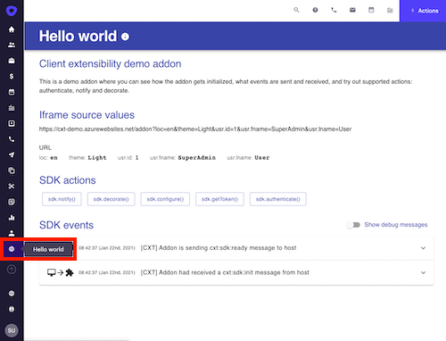
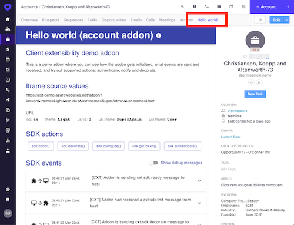

# Outreach extensibility SDK

This document contains all the information a developer needs to create an Outreach application.

Table of content

- [Outreach extensibility SDK](#outreach-extensibility-sdk)
  - [How it works](#how-it-works)
  - [Required steps to build an Outreach application](#required-steps-to-build-an-outreach-application)
  - [What can you make?](#what-can-you-make)
    - [Shell extensions](#shell-extensions)
    - [Tab extensions](#tab-extensions)

## How it works

When an Outreach user goes to a specific part of the Outreach application (e.g., opportunity page), the application will
check if that user has installed applications for that part of the app and (if yes):

- Add a tab with the title of the application
- Add an iframe with the source pointing to an application hosting page
- Send the current user contextual information to the application to initialize itself into a proper state.

## Required steps to build an Outreach application

The extensibility framework supports a few integration methods with different coding requirements and provides a
different integration level with Outreach. Each one of the methods requires one or more steps to be implemented based on
the application requirements.

1. Every application needs to have an application hosting web page, which will Outreach users see loaded as a source of
   application iframe. This page implementation has to follow [a very small set of requirements](host-requirements.md).

   _During the development phase, application creators can skip this requirement and use only a
   [Locally hosted application page](devxp.md) without the need to have a publicly available page._

2. Every application also needs to **create and upload a manifest file**. That manifest file contains things like the
   URL where the application web page is located, contextual information which application needs from Outreach, details
   about Outreach API access, etc.

   If your application is **stateless** (e.g., currency exchange calculator application) or your application has
   **independent initialization** (e.g., initialize itself based on its cookie), there is no need for any additional
   work to be done.

   Go to [manifest file](manifest.md) page to learn more.

3. All stateful applications would need contextual information from Outreach to initialize themselves in the proper
   state. For that, they need to **parse from the URL** a set of contextual information (e.g., opportunity id, prospect
   email, etc.) sent by Outreach.

   Go to [host url parameters parsing](url-parsing.md) page to learn more.

4. Most of the applications would want to have **deeper integration with the Outreach application** (e.g., to notify
   Outreach users about some application event). For that, the application will need to integrate Outreach client sdk.

   Go to [Outreach client SDK](sdk.md) page to learn more.

5. Some of the applications will need to have **client access to Outreach API**, and for that, they will need to add
   support on the application server required for obtaining and refreshing access tokens. This will include implementing
   additional endpoints, server to server calls to Outreach API, token caching, etc.

   Go to [Outreach API access](outreach-api.md) page to learn more about API access requirements.

   _If you have any questions/comments/concerns about the extensibility, please email us at `cxt-sdk@outreach.io`_

## What can you make?

There are two application extensions with the Outreach client sdk: shell extensions and tab extensions.

### Shell extensions

A shell extension is a type of extension where the application creator wants to extend the shell of the Outreach
application by bringing a more complex, standalone application experience.

 e.g., the "Shell application" extension has an
icon in the left side menu at the same level as other Outreach icons. Clicking on that icon will load an iframe taking
the whole space and showing the extension host page defined in the manifest.

Application extension can receive only user and organisation [contextual information](context.md).

Application extension can define a special [notifications endpoint](manifest.md#notificationsurl), enabling it to
implement things such as unread notifications badge decoration, show informational toast, etc., even before Outreach
user interacted with the addon.

### Tab extensions

Tab extension enables you to load your application in a context of a specific account, prospect, or opportunity. Your
application is loaded as an additional tab beside other standard Outreach tabs.

Tab extensions are loaded after the tab is being opened. In addition to the organization and user context available to
application extension, they can receive current account context (account tab), current prospect context (prospect tab),
and current opportunity context (opportunity tab).

In addition to account/propsect/opportunity tab extensions we support also "reports tab extension" which allows you to
extend Outreach reporting capabilities.

