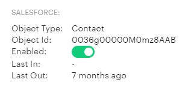

<!-- omit in toc -->

# Outreach context properties

Table of content:

- [Outreach context properties](#outreach-context-properties)
  - [Account contextual information](#account-contextual-information)
  - [Opportunity contextual information](#opportunity-contextual-information)
  - [Prospect contextual information](#prospect-contextual-information)
  - [User contextual information](#user-contextual-information)
  - [Organization contextual information](#organization-contextual-information)
- [External contextual information](#external-contextual-information)

Every Outreach application can request one or more contextual values describing the current Outreach user.

The properties are grouped into four groups: account, opportunity, prospect, and user.

_In case you would like to have additional contextual properties, please contact us on **cxt-sdk@outreach.io.**_

## Account contextual information

If an application needs contextual information about the current account Outreach user is looking at, it will need to
add to manifest one or more account properties.

Our end goal is to provide contextual access to any of the properties available through the
[Outreach API](https://api.outreach.io/api/v2/docs#account), but at the moment we support in
[SDK](../src/context/keys/AccountContextKeys.ts) next properties:

- **acc.cstmId** A custom ID for the account, often referencing an ID in an external system.
- **acc.cstmId** A custom ID for the account, often referencing an ID in an external system.
- **acc.desc** A custom description of the account.
- **acc.domain** Account company domain
- **acc.id** Account id
- **acc.loc** The company’s primary geographic region (e.g. "Eastern USA").
- **acc.name** The name of the company (e.g. "Acme Corporation").
- **acc.tags** A list of tag values associated with the account (e.g. ["Enterprise", "Tier 1"]).
- **acc.csf1** to **acc.csf150** the value of the (1-150) account's custom field.

## Opportunity contextual information

If an application needs contextual information about the current opportunity the Outreach user is looking at, it will
need to add to manifest one or more opportunity properties.

Our end goal is to provide contextual access to any of the properties available through the
[Outreach API](https://api.outreach.io/api/v2/docs#opportunity), but at the moment, we support in
[SDK](../src/context/keys/OpportunityContextKeys.ts) next properties:

- **opp.amnt** The amount the opportunity is worth.
- **opp.desc** A description of the opportunity.
- **opp.ecrat** The date the opportunity was created in the external system.
- **opp.id** Opportunity id
- **opp.name** The name of the opportunity.
- **opp.nstp** The next step to take for the opportunity.
- **opp.prob** The chances of the opportunity succeeding are represented as a percentage.
- **opp.tags** Tags associated with the opportunity.
- **opp.type** The type of opportunity.
- **opp.csf1** to **opp.csf150** the value of the (1-150) opportunity's custom field.

## Prospect contextual information

If an application needs contextual information about the current prospect Outreach user is looking at, it will need to
add to manifest one or more prospect properties.

Our end goal is to provide contextual access to any of the properties available through the
[Outreach API](https://api.outreach.io/api/v2/docs#prospect), but at the moment, we support in
[SDK](../src/context/keys/ProspectContextKeys.ts) next properties:

- **pro.accnme** Prospect account name.
- **pro.accdmn** Prospect domain.
- **pro.avail** The date and time the prospect is available to contact again.
- **pro.adrcity** City of the prospect
- **pro.adrcntry** Country of the prospect
- **pro.adrstate** State of the prospect
- **pro.adrstreet** Street address of the prospect
- **pro.adrstreet2** Street address (2nd line) of the prospect
- **pro.adrzip** Postal code of the prospect.
- **pro.comp** The name of the prospect company. If associated with an account, this is the name of the account. (e.g.
  Acme International).
- **pro.domain** Prospect company name
- **pro.emails** A list of email addresses associated with the prospect.
- **pro.loc** The locality of the prospect's company.
- **pro.id** Prospect id
- **pro.name** Prospect company name
- **pro.tags** A list of tag values associated with the account (e.g. ["Interested", "2017 Expo"]).
- **pro.tzone** The prospect's current timezone, preferably in the IANA format (e.g., "America/LosAngeles").
- **pro.title** The title of the prospect.
- **pro.csf1** to **pro.csf150** the value of the (1-150) prospect's custom field.

## User contextual information

If an application needs contextual information about the current Outreach user, it will need to add to manifest one or
more user properties.

Our end goal is to provide contextual access to any of the properties available through the
[Outreach API](https://api.outreach.io/api/v2/docs#user), but at the moment, we support in
[SDK](../src/context/keys/UserContextKeys.ts) next properties:

- **usr.email** The email address of the user.
- **usr.fname** The first name of the user.
- **usr.id** user id.
- **ust.lname** The last name of the user.
- **ust.name** The full name of the user.
- **ust.role** The role of the user.
- **usr.tit** The user's job title (e.g., "Staff Accountant").
- **usr.uname** A reader-friendly unique identifier of the user.
- **usr.csf1** to **usr.csf5** the value of the (1-5) user's custom field.

## Organization contextual information

If an application needs contextual information about the current Outreach user organization, it will need to add to
manifest one or more user properties.

Our end goal is to provide contextual access to any of the properties available through the
[Outreach API](https://api.outreach.io/api/v2/docs#user), but at the moment, we support in
[SDK](../src/context/keys/OrganizationContextKeys.ts) next properties:

- **org.cur** Default organization currency
- **org.id** Oranization id
- **org.logo** Organization logo url
- **org.name** Organization full name
- **org.short** Organization short name

# External contextual information

Every Outreach user can have one or more plugins installed and connect Outreach with Salesforce, Dynamics, and other
providers of prospect, account, and opportunity data.

Once a plugin is installed (Settings/Plugins) and synchronizing data with the external data source prospect page will
show a new section with external prospect information.

We have created SDK support for a set of dedicated manifest keys to enable application creators to receive this external
prospect information and use it to link data in their own dataset with the outreach account through the same shared
external ID used in both systems.

There are six context keys available for application creators to access current Outreach user info:

- **acc.extid** retrieving external id of the Outreach account id in the external system.
- **acc.extprvd** retrieving account provider name (Salesforce, Dynamics, etc.)

- **pro.extid** retrieving external id of the Outreach prospect id in the external system.
- **pro.extprvd** retrieving prospect provider name (Salesforce, Dynamics, etc.)

- **opp.extid** retrieving external id of the Outreach opportunity id in the external system.
- **opp.extprvd** retrieving external opportunity info
