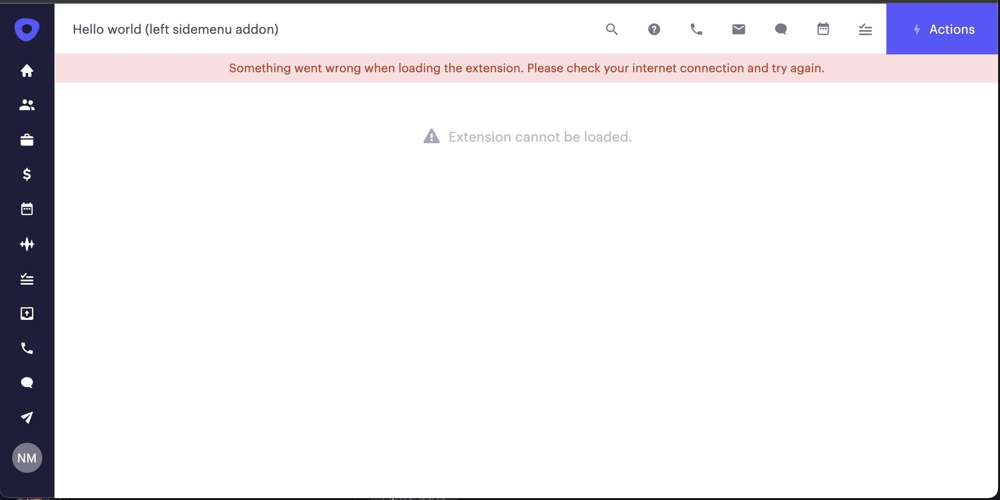

<!-- omit in toc -->
# Outreach application page host requirements

This document outlines the page's general add-on hosting requirements defined in [manifest.url](manifest.md#url). Outreach will create an iframe for the add-on and set its src property to this URL. Thus, the URL response needs to fulfill a few simple requirements for proper add-on functionality.

Table of content:

- [Content Security Policies (CSP)](#content-security-policies-csp)
- [Valid response codes](#valid-response-codes)
- [Timeouts](#timeouts)

## Content Security Policies (CSP)

Response served from manifest URL address has to enable embedding the page content. The most secure way to achieve that is utilizing [framew ancestor](https://developer.mozilla.org/en-US/docs/Web/HTTP/Headers/Content-Security-Policy/frame-ancestors) policy, which explicitly defines what domains are allowed to host an iframe that will load the add-on page.

That is why the response needs to have the next header:

```http
content-security-policy: frame-ancestor 'self' *.outreach.io
```

## Valid response codes

In most cases, the response will contain 200 (OK) status code, but as described in [url parsing](URL-parsing.md) document, it can sometimes result in 404 (NOT FOUND) status code (add-on host has no content to serve for provided Outreach context) and 302 (FOUND) in case additional Outreach needs to make a further request for the add-on to works properly.

The outreach host will treat any other response codes as invalid and not load the add-on in that case.

## Timeouts

Every add-on needs to provide a response in no more than 10 seconds to protect the user experience of Outreach users. 
If the add-on does not produce a valid response in that time, it will not be loaded, and instead, an error screen will be shown to the end-user

