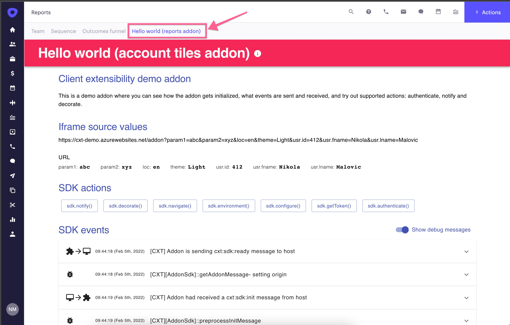

<!-- omit in toc -->

# Manifest file

Table of content:

- [Manifest file](#manifest-file)
  - [Sample manifest](#sample-manifest)
  - [Manifest JSON schema](#manifest-json-schema)
  - [Store section properties (store)](#store-section-properties-store)
    - [author](#author)
    - [categories](#categories)
    - [description](#description)
    - [headline](#headline)
    - [identifier](#identifier)
    - [icon (of application)](#icon-of-application)
    - [locales](#locales)
    - [medias](#medias)
    - [title](#title)
    - [version](#version)
  - [Outreach Oauth API access section ("api")](#outreach-oauth-api-access-section-api)
    - [applicationId](#applicationid)
    - [redirectUri](#redirecturi)
    - [scopes](#scopes)
    - [connect](#connect)
  - [Configuration section (configuration)](#configuration-section-configuration)
  - [Extensions section (extensions)](#extensions-section-extensions)
    - [Shared extension properties](#shared-extension-properties)
      - [identifer (extension)](#identifer-extension)
      - [version (extension)](#version-extension)
    - [Tab extension properties](#tab-extension-properties)
      - [context (tab extension)](#context-tab-extension)
        - [Shell application extension](#shell-application-extension)
        - [Account tab extension](#account-tab-extension)
        - [Prospect tab extension](#prospect-tab-extension)
        - [Opportunity tab extension](#opportunity-tab-extension)
        - [Reports tab extension](#reports-tab-extension)
      - [Environment (tab extension)](#environment-tab-extension)
        - [fullWidth (tab extension)](#fullwidth-tab-extension)
        - [decoration (shell extension)](#decoration-shell-extension)
      - [Host (tab extension)](#host-tab-extension)
        - [url](#url)
      - [icon (of extension)](#icon-of-extension)
      - [type](#type)
      - [notificationsUrl](#notificationsurl)

Manifest is a simple JSON file that the application developer uploads to Outreach and which contains all of the data needed for Outreach to host the application in an iframe.

All of the manifest properties are grouped in a few groups:

- **Store section** (title, description, author info, etc.)
- **Api section** - optional (what scopes application needs for accessing Outreach API)
- **Configuration section** - optional (what values we should collect from an Outreach user installing the application)
- **Extensions section** - definition of one or more extensions that are part of this application

## Sample manifest

Here is the sample manifest file of the hello world application having two extensions: application tab extension and opportunity tab extension.

```json
{
  "store": {
    "author": {
      "company": "Acme ltd",
      "email": "author@someurl.com",
      "privacyUrl": "https://someurl.com/privacy",
      "supportUrl": "https://someurl.com/support",
      "termsOfUseUrl": "https://someurl.com/tos",
      "websiteUrl": "https://someurl.com/"
    },
    "categories": [
      "account_based_marketing"
    ],
    "description": {
      "en": "Some description (en)"
    },
    "headline": {
      "en": "Some short description (en)"
    },
    "iconUrl": "https://someurl.com/image.png",
    "identifier": "app-identifier",
    "locales": [
      "en"
    ],
    "medias": [
      {
        "url": "https://someurl.com/image.png",
        "title": "Our awesome extension",
        "type": "image"
      },
      {
        "url": "https://youtube.com/some_video",
        "title": "Our awesome animation",
        "type": "video"
      }
    ],
    "title": {
      "en": "Some title (en)"
    },
    "version": "0.10"
  },
  "api": {
    "scopes": [
      "accounts.all",
      "calls.all"
    ],
    "applicationId": "AbCd123456qW",
    "redirectUri": "https://application-host.com/hello-world",
    "connect": "https://someurl.com/connect"
  },
  "externalInstallationUrl": "https://somestore.com/acme/application",
  "configuration": [
    {
      "key": "apikey",
      "text": {
        "en": "Enter API Access Key"
      },
      "type": "string",
      "required": true,
      "urlInclude": true
    }
  ],
  "extensions": [
    {
      "context": [
        "usr.id"
      ],
      "identifier": "hello-world-app",
      "environment": {
        "fullWidth": false,
        "decoration": "none"
      },
      "host": {
        "icon": "http://someurl.com/favicon.png",
        "url": "http://someurl.com/host/app",
        "notificationsUrl": "https://addon-host.com/notification",
      },
      "type": "shell-application",
      "version": "0.98"
    },
    {
      "context": [
        "usr.id",
        "opp.id"
      ],
      "identifier": "hello-world-opportunity",
      "environment": {
        "fullWidth": false,
        "decoration": "none"
      },
      "host": {
        "icon": "http://someurl.com/favicon.png",
        "url": "http://someurl.com/host/opp"
      },
      "type": "tab-opportunity",
      "version": "0.99"
    }
  ]
}
```

## Manifest JSON schema

Internally we validate each submitted manifest using the following schema
[Manifest JSON schema v2.0](schema/2.0/manifest.schema.json)

A manifest can be validated using the [online tool](https://www.jsonschemavalidator.net/)

## Store section properties (store)

### author

This section contains information to be presented to a user of the application in the marketplace and on the consent screen. It contains following string attributes all of which are required:

- `company` - Name of the company publishing application
- `email` - E-mail address for contacting applications support team
- `privacyUrl` - Url of the application creator privacy policy
- `supportUrl` - Url of the dedicated application support page
- `termsOfUseUrl` - Url of the application terms of use policy
- `websiteUrl` - Website of the application creator

### categories

A collection of one or more categories to which the application belongs.
It is used by Outreach users to list relevant applications in the Outreach Marketplace.
Supported values are listed in [Category.ts](../src/manifest/store/Category.ts)

### description

A localized application description is shown in the Outreach Marketplace at application details page to explain what it does and why someone wants to install it.

### headline

A localized application headline is shown in the Outreach Marketplace together with title and icon at the application list/tiles page as well as at application details page.

### identifier

Unique identifier of the application as defined by the application creator. The identifier may contain uppercase or lowercase letters ('A' through 'Z'), numbers, underscores ('_'), hyphens('-') and dots('.'). The minimum length is 6 characters a the maximum is 128.

### icon (of application)

URL of the Application icon shown in the Outreach Marketplace.


### locales

A collection of one or more culture locales (e.g. 'en') supported by the application.

### medias

A collection of media files (images and videos) shown in the Outreach Marketplace.

### title

The localized application title shown in the Outreach Marketplace.

### version

A version of the application manifest in the format MAJOR.MINOR

## Outreach Oauth API access section ("api")

This section is optional.
If the application doesn't need access to outreach API, this section can be omitted.

### applicationId

This is the value used for [API authentication flow](https://api.outreach.io/api/v2/docs#authentication)as client_id value.

### redirectUri

This URL is defined in Outreach OAuth settings, which the authorization form will use to redirect once the user consent with granting access to Outreach API in his name. This URL can be the same as the [host url](#url) or a separate URL, but in both cases, it has to be implemented in a way matching [Outreach API access requirements](outreach-api.md).

### scopes

In the scopes section, the application creator defines Outreach API scopes needed for performing API calls the application needs to perform.

A complete list of all of the API scopes can be found on [API Scopes page](scopes.md).

On the first [SDK authentication](sdk.md#authentication) Outreach, the user is asked to consent to grant requested scopes to the application

s

### connect

This value contains URL of the [token endpoint](outreach-api.md#connect-endpoint).
Note: The domain of the connect Uri has to be the same as the domain of the [host.url](#url)

## Configuration section (configuration)

This section is optional.

If the application doesn't need a user-specific runtime configuration, this section can be omitted. It is also ignored for applications with externalInstallationUrl specified.

In this section, the application creator defines what information should collect from the user and pass it to the application as a part of the initialization process.

To learn more about configuration section, go to [manifest configuration page](configuration.md)


## External installation Url

URL of the external installation page. This is the optional property and is used only in case when the application should be installed outside
of Outreach Marketplace

## Extensions section (extensions)

This section contains one or more extensions belonging to the Outreach application.

Those extensions can be of various types (tab extensions, tile extensions, etc.).
Each one of these types can have additional subtypes (e.g., tab extensions can be: reports, account, opportunity, or prospect tab extensions).

The application can contain a bundle of one more extension of any type/subtype.

### Shared extension properties

Every extension has to implement a set of common properties defined in [Extension.ts](../src/manifest/extensions/Extension.ts).

#### identifer (extension)

A unique identifier of the extension (used in logs, telemetry, etc.)

#### version (extension)

The current version of the extension (used in logs, telemetry, etc.)

### Tab extension properties

Every tab extension has to implement a few properties defined in [TabExtension.ts](../src/manifest/extensions/tabs/TabExtension.ts).

#### context (tab extension)

This section contains a list of predefined context information that the application needs from Outreach to be sent during the initialization process.
It is a string array of predefined Outreach properties describing attributes of the Outreach user loading the application.

e.g. ["opp.id", "acc.id"]

Outreach Users will be asked to consent to share this information before the application is installed from the Outreach Marketplace. For example, suppose the admin installs an application for other users. In that case, the admin is consenting to share the defined context properties for all the org users he is installing it for.

To learn more about the list of all of the supported context properties, go to [context property page](context.md).

There are four types of tab extensions, and each one of them can use only an available subset of contextual information.

##### Shell application extension

As defined in [ApplicationTabExtension.ts](../src/manifest/extensions/tabs/ApplicationTabExtension.ts) this type of tab extensions can use:

- [UserContextKeys.ts](../src/context/keys/UserContextKeys.ts)
- [ClientContextKeys.ts](../src/context/keys/ClientContextKeys.ts)

The reason for that is that the shell application extension is hosted on the left side menu and has no context information about any current account/prospect/opportunity, so it can use only context information about the current user and client context.

##### Account tab extension

As defined in [AccountTabExtension.ts](../src/manifest/extensions/tabs/AccountTabExtension.ts) this type of tab extensions can use:

- [UserContextKeys.ts](../src/context/keys/UserContextKeys.ts)
- [ClientContextKeys.ts](../src/context/keys/ClientContextKeys.ts)
- [AccountContextKeys.ts](../src/context/keys/AccountContextKeys.ts)

Account tab extension is running in the context of the account Outreach user is looking at, so in addition to general contextual properties, it can also use [account context properties](../src/context/host/AccountContext.ts).

##### Prospect tab extension

As defined in ProspectTabExtension.ts](../src/manifest/extensions/tabs/ProspectTabExtension.ts) this type of tab extensions can use:

- [UserContextKeys.ts](../src/context/keys/UserContextKeys.ts)
- [ClientContextKeys.ts](../src/context/keys/ClientContextKeys.ts)
- [ProspectContextKeys.ts](../src/context/keys/ProspectContextKeys.ts)

Prospect tab extension is running in the context of the account Outreach user is looking at, so in addition to general contextual properties, it can also use [prospect context properties](../src/context/host/ProspectContext.ts).

##### Opportunity tab extension

As defined in OpportunityTabExtension.ts](../src/manifest/extensions/tabs/OpportunityTabExtension.ts) this type of tab extensions can use:

- [UserContextKeys.ts](../src/context/keys/UserContextKeys.ts)
- [ClientContextKeys.ts](../src/context/keys/ClientContextKeys.ts)
- [OpportunityContextKeys.ts](../src/context/keys/OpportunityContextKeys.ts)

Prospect tab extension is running in the context of the account Outreach user is looking at, so in addition to general contextual properties, it can also use [opportunity context properties](../src/context/host/OpportunityContext.ts).

##### Reports tab extension

As defined in ReportsTabExtension.ts](../src/manifest/extensions/tabs/ReportsTabExtension.ts) this type of tab extensions can use:

- [UserContextKeys.ts](../src/context/keys/UserContextKeys.ts)
- [ClientContextKeys.ts](../src/context/keys/ClientContextKeys.ts)

As the extension is not running in context of any specific domain entity, this application is similar to shell extensions as it can't use additional keys.

#### Environment (tab extension)

This is the optional section where the application creator can express expectations the Outreach host environment has to match for the application to function correctly.

##### fullWidth (tab extension)

e.g., to remove right pane and show application tab using whole page width

```javascript
manifest.host.environment = {
  fullWidth: true,
};
```

##### decoration (shell extension)

e.g., to show an application icon badge decoration

```javascript
manifest.host.environment = {
  decoration: 'simple',
};
```

#### Host (tab extension)

The host section contains the application hosting endpoints and attributes implemented by the application creator.

##### url

Address where the application hosting web page is hosted.

This URL can be a direct URL without any value placeholders, in which case the Outreach host will add all of the contextual parameters as query parameters.

e.g.

```javascript
manifest.host.url = 'http://somesite.com/something';
manifest.context = ['opp.id', 'usr.id'];
```

In the case of an Outreach user with id 456 looking at opportunity 123, this will result during the runtime.

```bash
 http://somesite.com/something?opp.id=123&usr.id=456
```

In addition to this default behavior, the application creator can customize how the URL is constructed by applying simple templatization in addition to this default behavior.

e.g.

```javascript
manifest.host.url = 'http://somesite.com/something/{usr.id}';
```

will become during the runtime

```bash
http://somesite.com/something/456?opp.id=123
```

_NB: as opp.id was not tokenized, it was appended as query parameter following the default naming convention_

The application creator can templatize the name of the query parameters.

e.g.

```javascript
manifest.host.url = 'http://somesite.com/something/{usr.id}?oid={opp.id}';
```

will become during the runtime

```bash
http://somesite.com/something/456?oid=123
```

#### icon (of extension)

base64 string that represents the icon shown in the Outreach client.

#### type

The Outreach application supports different types of tab extensions, which can be loaded in different parts of the application.
Type property defines what the type of tab extension is and where it should be loaded.

SDK supported application types (as defined in [ShellExtensionType.ts](../src/manifest/extensions/shell/ShellExtensionType.ts), [TabExtensionType.ts](../src/manifest/extensions/tabs/TabExtensionType.ts) and [TileExtensionType.ts](../src/manifest/extensions/tiles/TileExtensionType.ts)) are:

- `shell-application` (application extension a.k.a 'left side menu addon')
- `tab-account` (account details tab extension)
- `tab-opportunity` (opportunity details tab extension)
- `tab-prospect` (prospect details tab extension)
- `tab-reports` (reports page tab extension)
- documentation for other supported types is to be added later

Application tab extension example


Account tab extension example




#### notificationsUrl

This is optional address of the endpoint serving notification centric version of the addon experience.

If defined, this endpoint will serve an empty HTML page with SDK on it, and the Outreach app will load it early without the need for user interaction.
That's how addon can update badge decoration and invite Outreach user to open full addon experience as defined in host.url property.

Only appllication addons of AddonType.LeftSideMenu type can only use this property.

_To see a sample of how to use this in your addon code look at the [Beacon addon sample addon](https://github.com/getoutreach/clientxtdocs/blob/master/samples/beacon/src/App.tsx)_
