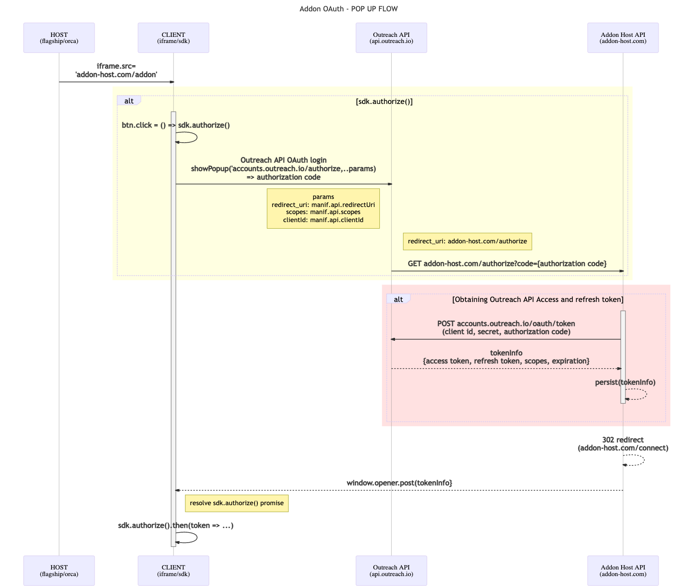

<!-- omit in toc -->

# Outreach API access support

- [How Outreach API access works](#how-outreach-api-access-works)
- [OAuth sequence diagram](#oauth-sequence-diagram)
- [Prerequisites](#prerequisites)
  - [Define required scopes](#define-required-scopes)
  - [Setup Outreach OAuth application](#setup-outreach-oauth-application)
- [Outreach API consent](#outreach-api-consent)
- [Authorization endpoint](#authorization-endpoint)
  - [Obtain access and refresh token](#obtain-access-and-refresh-token)
  - [Caching the tokens](#caching-the-tokens)
  - [Refreshing the access token](#refreshing-the-access-token)
  - [Closing the authentication loop](#closing-the-authentication-loop)
- [Connect endpoint](#connect-endpoint)

Suppose an add-on needs to make an impersonalized call to Outreach API in the current Outreach user context. In that
case, the add-on creator needs to implement a public authentication host server accessible on the internet with a few
required endpoints.

## How Outreach API access works

All [Outreach API](https://api.outreach.io/api/v2/docs#authentication) requests must be authenticated with a token in
the request's HTTP Authorization header.

To enable obtaining that token, Outreach API supports OAuth flow where the Outreach user needs to consent for giving API
access rights with the [scopes](scopes.md) defined in the add-on manifest.


Once a user consent to that and authorize Outreach API access, [initial authentication flow](#oauth-sequence-diagram)
will start.

A request to the authorisation endpoint defined in one of [redirectUris](manifest.md#redirecturis) will be made with a
**"code"** query parameter value sent from Outreach authentication server. This code is a short-lived authorization
token used with [Outreach client](manifest.md#client), and Outreach OAuth app secret so a proper Outreach API access
token and refresh tokens could be obtained.

The add-on host can use an access token to access Outreach API in the name of the current add-on user. It can also cache
the retrieved tokens and use them in the future to refresh expired access tokens, so the next time user needs to obtain
a new Outreach API access token, it doesn't have to go again through the consent flow.

## OAuth sequence diagram



As you can tell from the sequence diagram, there are a few steps "Add-on host API" needs to implement to support
Outreach API access:

1. Addon renders a "Login with Outreach" button and in click handler of that button invokes `sdk.authenticate()`
   function

   - Addon opens popup using the Outreach [API authentication URL](https://api.outreach.io/api/v2/docs#authentication).
     Constructing of this url relies on manifest.api section configuration: [client.id](manifest.md#client),
     [redirectUris](manifest.md#redirecturis) and [scopes](manifest.md#scopes) values.
   - When user clicks **Authorize** button on [Outreach consent screen](assets/api-consent.png), Outreach will redirect
     to `/authorize` endpoint on one of ([manifest.api.redirectUris](manifest.md#redirecturis)) address with a short
     living authorization code passed as query param.

2. Add-on host **authorize endpoint** will then:

   - use received authorization code with Outreach app id and the secret to obtaining Outreach API access and refresh
     token
   - cache the retrieved tokens using a cache key with add-on specific identity value so it can be later retrieved for a
     given add-on user..
   - redirect to connect endpoint with &result=ok parameter

3. Host **connect endpoint** then:

   - Sends POST message to the add-on window with result parameter, which opens the popup
   - Close itself

4. Post message is then:
   - received on add-on page by SDK
   - `sdk.authenticate()` promise is:
     - resolved if the result is ok
     - rejected if the result is fail

## Prerequisites

In order for all these steps to be implemented, there are certain things add-on creator has to do in preparation for
their implementation:

- [Define required scopes](#define-required-scopes)
- [Setup Outreach OAuth application](#setup-outreach-oauth-application)

### Define required scopes

The first step is to identify what access to the Outreach API you will need and produce a list of the scopes you will
need to achieve. You can pick any number of the scopes from the list of supported [API scopes](scopes.md), and they will
also be presented to the Outreach user on the first API request add-on will make. Outreach will need to provide the
consent with add-on having those permissions on Outreach API when performing requests in his name.

We recommend defining as few as possible and with as few rights possible as that will increase the percentage of
Outreach users willing to agree with giving these rights, so make sure you require a minimal number of scopes you can.

Requesting an Outreach user to consent with granting rights to a long list of scopes could be less effective than asking
them to approve for just a few. Also, asking Outreach users to agree on giving **Read-Only** access to a specific API
will likely be accepted by more users than a request for Read/Write/Delete operations.

The Outreach add-on review process includes reviewing the list of manifest scopes to ensure that add-on requests access
the optimal set of scopes is acceptable to the largest number of Outreach users.

### Setup Outreach OAuth application

You will need to create a dedicated Outreach OAuth application for your add-on, and to achieve that, don't hesitate to
get in touch with platform@outreach.io for assistance.

With that add-on OAuth application created, you will have:

- application identifier
- application secret
- redirect URI

_The redirect URI can be the same as the add-on host URL defined in the manifest or a dedicated URL._

In order to get more info on your OAuth app settings or change a redirectUri value, don't hesitate to get in touch with
the Outreach support team at cxt-sdk@outreach.io

## Outreach API consent

In order to collect authorization consent from users granting impersonated access rights using predefined scopes, the
add-on creator needs to simply call the [authenticate()](../src/index.ts) function. The function accepts optional
`redirectUri` parameter which has to be one of the redirectUris defined in
[manifest api.redirectUris](manifest.md#redirecturis). If the parameter is not provided, the first element of the array
will be used as `redirectUri`.

```javascript
await addonSdk.authenticate(); // The first element from redirectUris will be used
// or
await addonSdk.authenticate('https://application-host.com/hello-world'); // Has to be one of the redirectUris
```

In the case of Outreach **user never before provided such a consent**, they will see an OAuth popup where he will be
asked to approve impersonated API access with [scopes defined in manifest](manifest.md#scopes).


Once a user consents on this screen by clicking **Authorize**, Outreach will make a request to the authorization
endpoint URL address defined in the [manifest api.redirectUris](manifest.md#redirecturis) with a single additional
parameter **"code"**. This parameter will contain a short-lived authorization token that should be parsed out of the
query parameter and used to obtain the access and refresh tokens.

In case of Outreach **user already previously provided consent**, the popup authentication window will be loaded and
quickly closed without the need for the user to consent again, and the same request to authorization endpoint defined in
[manifest api.redirectUris](manifest.md#redirecturis) will be made with the **code** parameter.

## Authorization endpoint

### Obtain access and refresh token

As described in [Outreach API documentation](https://api.outreach.io/api/v2/docs#authentication), the add-on host uses
short-lived authorization code together with
[application id and the application secret](#setup-outreach-oauth-application) to obtain access and refresh tokens.

#### Request

```shell
curl https://api.outreach.io/oauth/token
  -X POST
  -d client_id=<Application_Identifier>
  -d client_secret=<Application_Secret>
  -d redirect_uri=<Application_Redirect_URI>
  -d grant_type=authorization_code
  -d code=<Authorization_Code>
```

#### Response

Response will contain all the data needed for accessing the token.

```json
{
  "access_token": <Access_Token>,
  "token_type": "bearer",
  "expires_in": 7200,
  "refresh_token": <Refresh_Token>,
  "scope": <Scope1+Scope2+Scope3>,
  "created_at": 1503301100
}
```

### Caching the tokens

When the add-on host has obtained this data, the add-on host needs to store the retrieved access and refresh tokens of
this add-on user. Later, when the user loads the add-on again, if the access token expires, the stored refresh token
could be used to generate a new access token without the need for requesting user consent again through the OAuth popup.

The token info should be cached using an add-on-specific identity of the add-on user, so in later sessions, it can be
retrieved for a given add-on user.

### Refreshing the access token

In case the access token has expired, the add-on host will use the cached refresh token to obtain a new version of the
application token as described in [Outreach API documentation](https://api.outreach.io/api/v2/docs#authentication).

Request (with a refresh token, application id, and secret)

```shell
curl https://api.outreach.io/oauth/token
  -X POST
  -d client_id=<Application_Identifier>
  -d client_secret=<Application_Secret>
  -d redirect_uri=<Application_Redirect_URI>
  -d grant_type=refresh_token
  -d refresh_token=<Refresh_Token>
```

Response

```json
{
  "access_token": <Access_Token>,
  "token_type": "bearer",
  "expires_in": 7200,
  "refresh_token": <Refresh_Token>,
  "scope": <Scope1+Scope2+Scope3>,
  "created_at": 1503308300
}
```

### Closing the authentication loop

Now when the add-on host obtained and cached the access token and cached the refresh token, it needs to send the
information to the SDK running in the add-on host page so a authorize () promise can be resolved.

To do that, the add-on host has to respond to the original request, with a
[302 Found](https://developer.mozilla.org/en-US/docs/Web/HTTP/Status/302) status code with the
[Location header](https://developer.mozilla.org/en-US/docs/Web/HTTP/Headers/Location) with the value of
[manifest api connect endpoint](manifest.md#connect)

```http
{MANIFEST.API.CONNECT} + "&result=ok"
```

- MANIFEST.API.CONNECT - it is the connect endpoint URL.
- result parameter can have values: ok and fail used to inform SDK if auth consent process succeeded or failed.

## Connect endpoint

Connect endpoint is a simple and specific HTML page with a small javascript implementation posting the result value to
the add-on page, which then closes the popup window.

Here is
[mvc core sample implementation](https://github.com/getoutreach/clientxtdocs/blob/master/samples/hello-world/aspnetcore/Views/Connect/Index.cshtml)
from our documentation repo (samples in other languages also available)

```html
<html lang="en">
  <head>
    <title>Outreach login connect page</title>
  </head>
  <body>
    <script>
      var url = new URL(window.location.href);
      var token = '@Model.Token';
      var expiresAt = '@Model.ExpiresAt';
      var target = '@Model.AddonHostOrigin';

      var data = JSON.stringify({
        type: 'cxt:connect:token',
        token,
        expiresAt,
      });

      if (window.opener) {
        window.opener.postMessage(data, target);
      }

      window.close();
    </script>
  </body>
</html>
```

The whole point of the code is to POST event with type 'cxt:connect:token' to the add-on page (window.opener) so the
add-on can get the new values.
