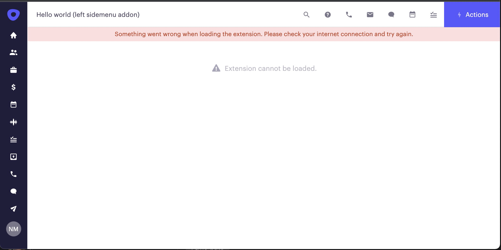

# URL parsing integration

## Retrieving the contextual values from the url

Any time when the Outreach loads an application, it will set as iframe source an URL created out of:

- host.URL value [defined in the manifest](manifest.md#url)
- query parameters representing [context values of current Outreach user](manifest.md#context) also defined in the manifest (e.g. "opp.id")
- [config parameters](configuration.md) (if any) which have [urlInclude](configuration.md##urlinclude) property enabled.
- query params which are always sent regardless of the manifest:
  - locale='en',
  - theme='light'
  - uid={usr.id}

That's how the resulting URL which Outreach will set as a source of iframe will be something like this:

```http
    https://addon-host.com/something?locale=en&uid=a1234&opp.id=123456
```

When the application loading request comes, the application has to parse out of request query parameter values and, based on them to return some of the next responses as described in [url parsing section](url-parsing.md)

## Timeout handling

As mentioned in [hosting requirements](host-requirements.md#timeouts), the Outreach application will show an error screen if the application doesn't respond in 10 seconds with a READY message.



Usually, suppose the application is implemented based on manual URL parsing. In that case, it doesn't reference this SDK, and thus that READY message event is not sent, which leads to an error screen even if the application is working fine.

There are two recommended solutions to tackle this if the application code can be modified:

1. reference the SDK and await sdk.init(), which will send a READY message without referencing the SDK,
2. manually send the event by implementing this code

```javascript
const addonHostOrigin = ‘https://app-hosting-domain.com;
window.parent.postMessage({type: ‘cxt:sdk:ready’, version: 2}, addonHostOrigin)
```

Only in the extreme case when modifications to the application page are not possible and recomended solutions are not possible, application creator can update manifest with information that application is "not using the SDK," so the Outreach host will skip the timeout check. This is not recomended, as Outreach host will not have any information on application QoS and it would have to be approved as an exception during the application review process.

```json
{
  ...
  notUsingSdk: false
  ...
} 
```
